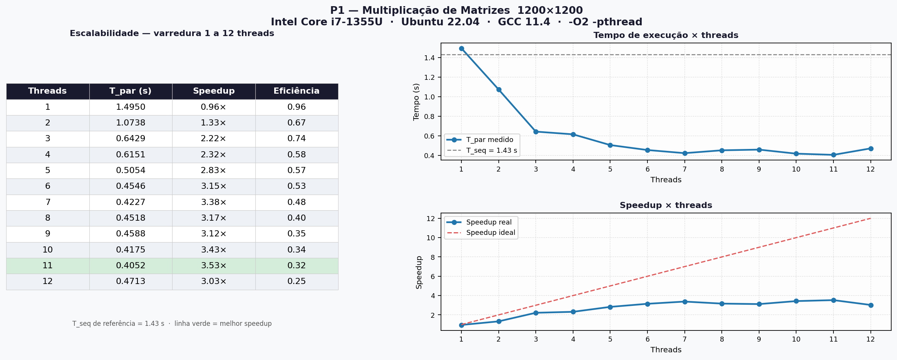

# Trabalho Prático 1 — LPII 2026.1

**Nome:** Heitor Gabriel Lucena Albuquerque  
**Matrícula:** 20240007980

---

## Problema escolhido: P1 — Multiplicação de matrizes grandes

Implementação sequencial e paralela do produto C = A × B para matrizes quadradas de tamanho N×N
armazenadas em row-major. A versão paralela divide as linhas de C igualmente entre as threads: cada
thread calcula um bloco de linhas sem nenhuma escrita compartilhada, eliminando a necessidade de
mutex. Por ser fortemente CPU-bound (custo O(n³)), esse problema é o que melhor demonstra speedup
real com pthreads. A corretude é verificada automaticamente comparando o checksum das duas versões.

---

## Como compilar

### Via CMake (recomendado)

```bash
cmake -B build && cmake --build build
./build/matmul          # roda com o número padrão de threads (NUM_THREADS em matrizes.h)
./build/matmul 4        # roda com 4 threads
```

### Via gcc (comando único)

```bash
gcc -O2 -Wall -Wextra -pthread src/main.c src/seq.c src/par.c -o matmul
./matmul                # roda com o número padrão de threads
./matmul 4              # roda com 4 threads
```

### Via Makefile

```bash
make
./matmul 4
```

---

## Arquivos do projeto

| Arquivo | Descrição |
|---|---|
| `src/seq.c` | Implementação sequencial de `multiply_seq` |
| `src/par.c` | Implementação paralela de `multiply_par` com pthreads |
| `src/main.c` | Cronometragem, verificação de corretude e tabela de speedup |
| `src/matrizes.h` | Constantes (`N`, `NUM_THREADS`, `NUM_RUNS`) e declarações |
| `gerar_grafico.py` | Script Python/matplotlib que gerou o `speedup.png` |

---

## Como variar o número de threads

Há duas formas:

**1. Argumento na linha de comando** (sem precisar recompilar):
```bash
./matmul 1
./matmul 2
./matmul 4
./matmul 8
./matmul 12
```

**2. Constante no código** — edite `NUM_THREADS` em `src/matrizes.h` e recompile:
```c
#define NUM_THREADS 12
```

---

## Ambiente de teste

| Item | Valor |
|---|---|
| CPU | Intel Core i7-1355U (13ª geração) |
| Núcleos físicos | 10 (2 P-cores + 8 E-cores) |
| Núcleos lógicos | 12 (Hyperthreading apenas nos P-cores) |
| Compilador | GCC 11.4.0 |
| Flags | `-O2 -Wall -Wextra -pthread` |
| Sistema operacional | Ubuntu 22.04.5 LTS |
| Kernel | 6.8.0-111-generic |

---

## Resultados

Matrizes de tamanho **1200×1200**, média de 5 execuções (primeira descartada como aquecimento).  
T_seq de referência: **1.43 s** (média das medições sequenciais de cada rodada).

### Q3 — Speedup com número de núcleos da máquina (12 threads)

| Threads | T_par (s) | Speedup        |
|---------|-----------|----------------|
| 1 (seq) | 1.43      | 1.00×          |
| 2       | 1.0738    | 1.33×          |
| 4       | 0.6151    | 2.33×          |
| 6       | 0.4546    | 3.15×          |
| 8       | 0.4518    | 3.17×          |
| 10      | 0.4175    | 3.43×          |
| 12      | 0.4713    | 3.03×          |

### Q4 — Varredura completa de 1 a 12 threads



> Linha verde = melhor speedup medido (T=11, 3.53×). Eficiência = Speedup / Threads.

### Discussão (Q4-C)

O speedup não é linear porque nenhum programa é 100% paralelizável — há sempre uma parcela sequencial que limita o ganho, conforme descrito pela **Lei de Amdahl**: `S = 1 / ((1 - P) + (P / N))`, onde P é a fração paralelizável e N o número de threads. Conforme N cresce, o termo `P/N` tende a zero e o speedup se aproxima de `1 / (1 - P)` — um teto fixo, independente de quantas threads sejam adicionadas. No nosso caso, assumindo P ≈ 0,90 (90% da computação paralelizável), o speedup máximo teórico seria `1 / (1 - 0,9) = 10×`; os **~3,5× medidos** representam cerca de 35% desse teto, o que é coerente com os 12 núcleos disponíveis. Um segundo fator é o **overhead de criação e junção de threads**: cada chamada a `pthread_create` e `pthread_join` tem custo computacional não nulo, e esse custo é pago integralmente a cada uma das execuções cronometradas — com poucos threads o overhead é proporcionalmente maior em relação ao trabalho realizado, e com muitos threads a soma desses custos começa a competir com o ganho de paralelismo, impedindo que o speedup continue crescendo de forma linear.

